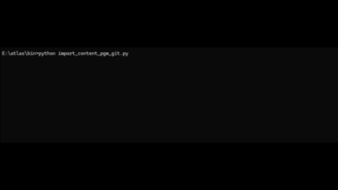
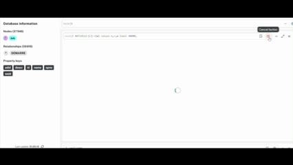

---
### Intelligence Opérationnelle & Haute Performance
*z/OS • Gouvernance du Mainframe • IA • RAG • GRAPH • Industrialisation*

gouvernance z/os mainframe atlas geoffrey lacroix msu dette technique dette organique analyse d'impact migration souveraineté auditabilité modernization modernisation IBM redhat kyndryl bce BPCE orion mysys compliance DORA IA Act RGPD sécurité nationale made in france capgemini sopra atos orange bussiness BNP SocGen crédit agricole cagip
---

## ⚡ Analyse Structurelle & Maîtrise des Flux

L'architecture **ATLAS** transforme le patrimoine complexe (**COBOL, JCL, GAP, Assembleur, Java, .NET**) en une cartographie vivante et exploitable :

* **Analyse d'Impact à 100% :** Parcourez instantanément la propagation des modifications dans votre système via le graphe. Zéro zone d'ombre, zéro dépendance oubliée.
* **Détection des Dettes technique, organique et structurelle:** Identification personnalisée et automatisée des risques du SI. Import compteurs d'utilisations, complexités cyclomatique, bus factoring, latence de propagation, dérive sémantique : vision laser. Rendre visible l'invisible pour sécuriser la continuité métier.
* **Maîtrise de l'Empreinte MIPS/MSU :** Optimisation structurelle du code pour une réduction réelle des coûts d'exploitation par une exécution ultra-efficace. Diminution des MSUs en modernizant le code prévu pour les anciennes architectures de processeur (31bits).

---

## 🧠 Vision & Gouvernance par les Données

L'informatique critique n'est plus une question de devinettes, c'est une question de contrôle et de visibilité. **ATLAS** répond aux enjeux de modernisation sans risque :

> **"Quel est l'outil, totalement open source, 100% IA locale gratuite, capable de cartographier des millions de nœuds de dépendances pour éclairer des décisions de migration ?"**

> **"Comment sécuriser un patrimoine logiciel en capturant le savoir des experts, pour le transformer en un graphe de connaissance auditable et pérenne ?"**

> **"Comment centraliser , mutualiser et transmettre la connaissance aux nouveaux arrivants avec une vision laser sur un patrimoine legacy, que nous subissons tous ?"**

---

## 🔍 Auditabilité, Souveraineté & IA Locale

Conformément aux exigences des secteurs stratégiques, ATLAS garantit un contrôle total sur l'évolution du système, en totale autonomie :

* **RAG sur Graphe (Zero-Hallucination) :** L'IA interroge exclusivement votre patrimoine structuré. Réponses factuelles, basées sur des *select* sur votre graphe, validées par l'humain.
* **Sandbox & Confidentialité :** Déploiement interne ("On-Premise"). Vos données et votre propriété intellectuelle restent dans votre environnement. Aucune donnée ne quitte le sanctuaire.
* **Sécurité Nationale :** La substance technique est protégée. Les brevets (INPI FR2603708 & FR2604480) garantissent la maîtrise de vos trajectoires de production.

---

## 🏗️ Écosystème ATLAS

* **ATLAS V1 :** Pont entre le monde Mainframe et l'intelligence augmentée (RAG/Graphes). Traduction de la dette technique en business intelligence.
* **ATLAS V2 :** Recursion et auditabilité. Système capable d'auto-analyse et de cartographie exhaustive des flux, garantissant une intégrité totale du patrimoine.

---

## 📩 Contact

 [Prendre contact](mailto:atlasblackswan@proton.me)

[Profil professionnel](https://geoffrey-lacroix-cv.github.io)

